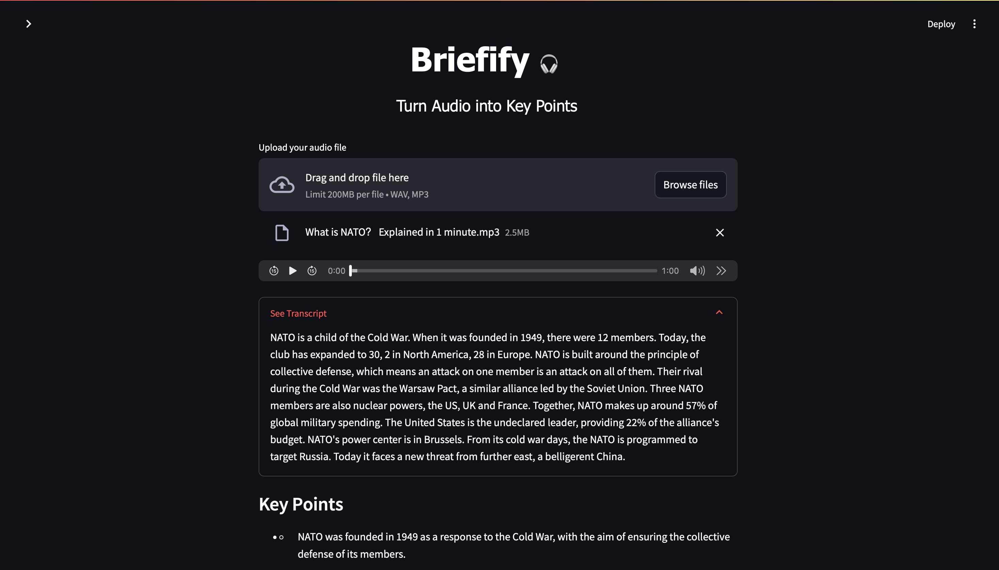

# Briefify 🎧: Turn Audio into Key Points

Briefify is a Streamlit web application that transcribes audio files using OpenAI's Whisper model and summarizes the transcript into concise key points using the TinyLLaMA language model. It provides a simple, user-friendly interface for quickly extracting insights from audio content.

## Features

- Upload audio files in `.mp3` or `.wav` formats
- Automatic speech-to-text transcription with Whisper-tiny for fast and accurate conversion
- Generation of summarized key points from transcripts using TinyLLaMA
- Clean, modern, and mobile-responsive UI built with Streamlit
- Audio playback for uploaded files
- Expandable transcript view with customized UI styling

## Demo

## Installation and Running Locally

1. **Clone the repository:**

2. **Create a virtual environment (recommended):**

3. **Install dependencies:**

- pip install -r requirements.txt

4. **Run the app:**

5. Open the URL provided by Streamlit in your web browser.

## Deployment

You can deploy this app easily on Streamlit Community Cloud:

- Push your code to GitHub.
- Log into [Streamlit Community Cloud](https://share.streamlit.io/) with your GitHub account.
- Connect your repository and select `stream.py` as the entry point.
- Streamlit Cloud installs dependencies and hosts your app with a public URL.
- No server management or infrastructure needed!

## Project Structure

briefify-app/
├── app.py
├── requirements.txt
└── README.md

## Technologies Used

- [Streamlit](https://streamlit.io/): fast and easy Python web app framework
- [OpenAI Whisper](https://github.com/openai/whisper): speech-to-text model for transcription
- [TinyLLaMA](https://huggingface.co/TinyLlama): lightweight language model for key point generation
- [Transformers](https://huggingface.co/docs/transformers/index): Hugging Face pipelines and models
- Python 3.9+

## Credits

- OpenAI for Whisper speech recognition model
- TinyLLaMA developers and community for key point generation model
- Streamlit team for enabling rapid app development

## License

This project is licensed under the MIT License. See the [LICENSE](LICENSE) file for more details.

---
